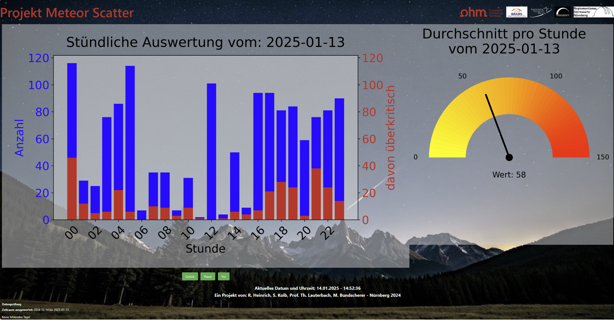

# Meteor Scatter

This project was developed as part of a student project. The aim was to detect and classify meteors using ML methods.

The project consists of two parts: the **Meteor Detection & Classification** and the **Flask Server**. The meteor detection & classification part is responsible for saving the detections in a CSV file. The Flask Server application reads the CSV file and displays the data in a web interface.



## Authors

- [Robert Heinrich](mailto:heinrich.robert93@yahoo.de)
- [Sebastian Kolb](mailto:sebastian.kolb@online.de)
- [Maximilian Bundscherer](mailto:maximilian.bundscherer@th-nuernberg.de)
- [Prof. Dr. Thomas Lauterbach](mailto:thomas.lauterbach@th-nuernberg.de)

## Meteor Detection & Classification

See other README file and subset in seperate folder [meteor_detect_class/](meteor_detect_class/)

## Flask Server

### Features

The Flask Server will process always the last full 30 days of csv-files and create multiple graphics. Build in Slideshow with

- daily display with hourly resolution of all Meteors and over critical ones
- 7-days-overfew with the sum of each day of all Meteors and over critical ones
- 30-days-overfew with the sum of each day of all Meteors and over critical ones
- a separate gauge-chart displaying the average hourly rate of the last day

With every startup of `app.py` the work-data-csv-file `final_dataframe.csv` will be verified and checked to its current status. Should there be missing data sets, it will be displayed at the bottom of the website Missing hours in single days will be skipped and not displayed in the charts.

Furthermore the `final_dataframe.csv` will be validated periotically (setup in `config.ini`: `#Scheduler Aktualisierungszeit CSV-Datensatz in minutes - schedule_interval = 2`) the validation process will search for the last entry and complare to the date of yesterday, no action if it matches, update file if there is a missmatch on the frontend the charts will be reloaded with a certain interval to be sure all displays are always up to date. (setup in `config.ini`: `#Aktualisierungszeit Website reload - reload_interval = 150000 - #60000 1min / 300000 5min`)

### Data Requirements

All data must be in the following structure to ensure 100% functionality:

`name: "YYYYMMDD.csv" in folder "csv_files"`

```
content format:
Timestamp;Anzahl;Kritisch
2024-11-30 00:05:00;101;0
2024-11-30 01:05:00;8;3
2024-11-30 02:05:00;99;21
... 
```

### Structure

```
-csv_files 
	-20241210.csv
	-20241211.csv
	-20241212.csv
	...
-static
	...
-templates
	...
-app.py
-config.py
-config.ini
-database.py
-initapp.py
-plot.py
-(final_dataframe.csv)
```

### Description

`app.py`: (run for main App)

The main App with all Flask routes. The IP adress and port can be set in the following line: `Line 174: app.run(host="0.0.0.0", port=5000, debug=debug_value)`

`config.py`:

Settings and fallback values as well as `config_read` and `config_get` functions.

`config.ini`:

Manipulate settings here if you are not a programmer and just the user to make it more like you need it. Rerun `app.py` and reload Website after changes.

`database.py`:

Processes all data provided by the Grabber and save in `final_dataframe.csv`.

`initapp.py`:

Initialise Flask App before start.

`plot.py`:

Creates all charts. If needed resolution of the charts can be manipulated here. Needs to be changed for each charts seperatly. (300dpi and figsize 10,6 will create a figure with resolution of 3000x1800px, can be reduced if less performace is needed).

### Install

Create a virtual environment, activate it, and install the requirements (`requirements.txt`).

### Run

Activate the virtual environment and run `app.py`.

### Debug

In `config.py` change following line, to get more Debug/Logging printout:

```
logging.XXXXXXXXXX   ERROR/WARNING/INFO options

console = logging.StreamHandler()
console.setLevel(logging.ERROR)  # Konsole für nur `INFO`-Level oder höher aktivieren
formatter = logging.Formatter("%(asctime)s - %(levelname)s - %(message)s")
console.setFormatter(formatter)
logging.getLogger("").addHandler(console)
```
