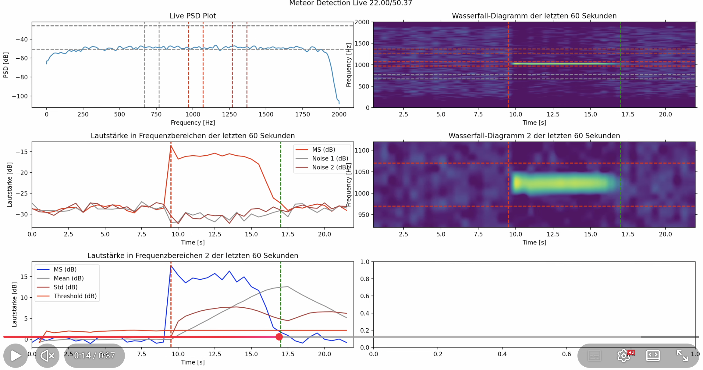

# Meteor Scatter (DSP-based)

**Note**: If you are here regarding the publication *Meteor Detection based on Forward Scattering with SDR and the BRAMS Beacon*: This page shows the *DSP-based* approach. Click [here](/) for the *ML-based* approach.

## Visualization

Click the image below to watch a video demonstration.

tbd
